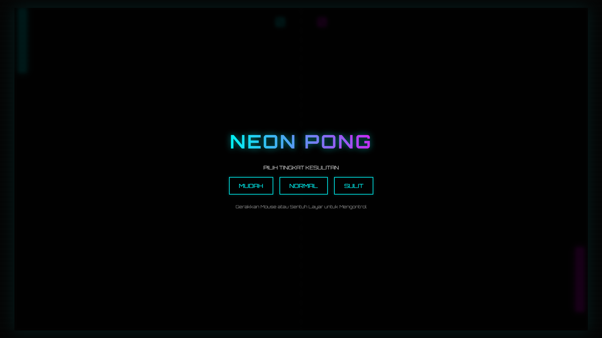

# Neon Pong AI

Neon Pong AI adalah game ping pong klasik yang dimodernisasi dengan estetika futuristik bertema neon, dikembangkan menggunakan HTML5, CSS3, dan JavaScript murni. Game ini sepenuhnya responsif dan dapat dimainkan secara offline di komputer maupun perangkat seluler.

## ✨ Fitur Utama

- Visual Neon Modern: Desain antarmuka gelap dengan efek cahaya glow (bersinar) menggunakan warna kontras Cyan dan Magenta.
- Audio Sintetis Offline: Menggunakan Web Audio API untuk menghasilkan efek suara (pantulan, skor, dinding) secara real-time tanpa memerlukan file audio eksternal (.mp3/.wav).
- Tingkat Kesulitan: Terdapat 3 pilihan kesulitan yang menyesuaikan kecepatan bola dan reaksi AI:
- Mudah (Easy): Bola lambat, AI santai.
- Normal (Medium): Kecepatan standar yang seimbang.
- Sulit (Hard): Bola cepat, AI sangat responsif dan sulit dikalahkan.
- AI Cerdas: Lawan komputer yang melacak pergerakan bola dengan algoritma pergerakan yang mulus (smooth tracking).
- Sistem Partikel: Efek visual ledakan partikel saat bola menabrak paddle.
- Responsif: Mendukung kontrol Mouse (Desktop) dan Sentuhan (Mobile/Tablet).
- Fitur Pause: Kemampuan untuk menghentikan permainan sementara.

## 🎮 Cara Bermain

1. Buka Game: Jalankan file neon_pong.html di browser web modern apa pun (Chrome, Firefox, Edge, Safari).
2. Pilih Tingkat Kesulitan: Klik salah satu tombol di menu awal (MUDAH, NORMAL, atau SULIT) untuk memulai.
3. Kontrol Paddle:
- Desktop: Gerakkan Mouse ke atas atau ke bawah.
- Mobile: Sentuh layar dan geser jari ke atas atau ke bawah.
4. Pause: Klik tombol || di pojok kanan atas atau tekan tombol Spasi / Esc pada keyboard untuk menjeda permainan.

## 🛠️ Teknologi yang Digunakan

- HTML5 Canvas: Untuk rendering grafis 2D yang performant (60 FPS).
- Web Audio API: Untuk sintesis suara prosedural.
- CSS3: Untuk styling UI, efek scanline, dan tipografi (Font 'Orbitron' dari Google Fonts).
- Vanilla JavaScript: Logika game tanpa library atau framework tambahan.

## 📦 Instalasi

Tidak perlu instalasi khusus. Karena ini adalah game berbasis browser single-file:
1. Unduh file neon_pong.html.
2. Klik dua kali file tersebut untuk membukanya di browser default Anda.
3. Nikmati permainan!

Dibuat untuk tujuan demonstrasi game development berbasis web sederhana namun menarik secara visual.